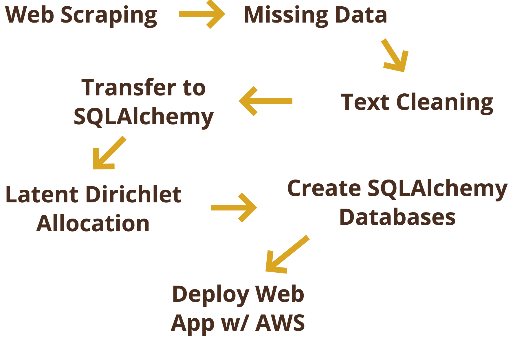

# A Journey Through Modern Era Philosophy
This app is live at [philosophyjourney.com](http://philosophyjourney.com)

# Motivation
Philosophy is a prime example of ideas changing the world.  Whether it be economics, political ideology, the freedom of man, or even the law of gravity, these are all ideas that fall under the realm of philosophy and have shaped the world as we know it today.

My goal with this project was to analyze the relationship between philosophy and the world.  How has philosophy influenced the world?  How has the world influenced philosophical discussion?  My project hopes to answer questions such as these.

# The Process

The first step of the process was web scraping various websites to obtain philosopher information as well as the full texts and other data for philosophical texts.

Then missing information was accounted for and entries with insufficient information dropped.

The full texts of the documents were then cleaned and prepared for analysis.  Latent Dirichlet Allocation was run on the prepped documents with varying topic sizes (150, 50, 25) and 30 passes.  The results of LDA were analyzed and utilized to glean insights into the data.  

These insights - along with the philosopher and document data - were then placed into an sqlite database using SQLAlchemy.

An app was created using Flask and front end web development technologies to visualize the results.  SQLAlchemy was used to communicate between the app and the database.

Although we used Python 2 throughout the program, I opted to use Python 3 for my project due to my project centering around Natural Language Processing.  Python 3's treatment of all text as unicode would remove the headache of dealing with both string and unicode data types.

*This provides a high-level summary of my project and the results obtained.  For a deeper dive into the process, see [process.md](process.md)*

# The Results
*If you haven't already, the final product of this project as well as my contact information can be found at [philosophyjourney.com](http://philosophyjourney.com)*

# Resources
### Data
#### Philosopher Data
* [Philosophy Basics](http://www.philosophybasics.com/historical.html)
* [Famous Philosophers](http://famous-philosophers.com/)
* [Wikipedia](https://en.wikipedia.org/)
* [English Club (Nationality Data)](https://www.englishclub.com/vocabulary/world-countries-nationality.htm)

#### Document Data
* [Early Modern Texts](http://www.earlymoderntexts.com/texts)
* [Sacred Texts](http://sacred-texts.com/phi/)
* [Sophia Project](http://www.sophia-project.org/classical-philosophy.html)
* <a href="https://www.gutenberg.org/wiki/Philosophy_(Bookshelf)">Project Gutenberg</a>
* [Value of Knowledge](https://www.marxists.org/reference/subject/philosophy/)
* [Internet Archive](https://www.archive.org)

### Technical Stack
#### Cloud Computing
* [Amazon Web Services](https://aws.amazon.com/)

#### General
* [Python 3](https://docs.python.org/3.0/)
* [NumPy](http://www.numpy.org/)
* [pandas](http://pandas.pydata.org/)
* [matplotlib](http://matplotlib.org/index.html)
* [multiprocessing](https://docs.python.org/2/library/multiprocessing.html)
* [pickle](https://docs.python.org/3/library/pickle.html)
* [os](https://docs.python.org/3/library/os.html)
* [collections](https://docs.python.org/2/library/collections.html)

#### Web Scraping
* [Requests](http://docs.python-requests.org/en/master/)
* [Beautiful Soup](https://www.crummy.com/software/BeautifulSoup/bs4/doc/)
* [Selenium](http://selenium-python.readthedocs.io/)
* [PDFMiner3k](https://pypi.python.org/pypi/pdfminer3k)
* [langdetect](https://pypi.python.org/pypi/langdetect?)
* [us](https://pypi.python.org/pypi/us)
* [geopy](https://pypi.python.org/pypi/geopy/1.11.0)
* [internetarchive](https://internetarchive.readthedocs.io/en/latest/index.html)
* [gutenberg](https://pypi.python.org/pypi/Gutenberg)
* [bsddb3](https://pypi.python.org/pypi/bsddb3/6.1.1)

#### Text Processing
* [spaCy](https://spacy.io/)
* [NLTK](http://www.nltk.org/)
* [autocorrect](https://pypi.python.org/pypi/autocorrect/0.1.0)
* [PyEnchant](http://pythonhosted.org/pyenchant/)

#### Text Analysis
* [gensim](https://radimrehurek.com/gensim/)
* [SciKit-Learn](http://scikit-learn.org/stable/)

#### Web Application
* [Flask](http://flask.pocoo.org/)
* [SQLAlchemy](http://www.sqlalchemy.org/)
* [HTML5](https://developer.mozilla.org/en-US/docs/Web/Guide/HTML/HTML5)
* [CSS3](https://developer.mozilla.org/en-US/docs/Web/CSS/CSS3)
* [Javascript](https://www.javascript.com/)
* [jQuery](http://jquery.com/)
* [D3.js](https://d3js.org/)
* [Leaflet.js](http://leafletjs.com/)

### Learning
* [Learning How to Build a Web Application](Learning How to Build a Web Application)
* [“Secret” Recipe for Topic Modeling Themes](http://www.matthewjockers.net/2013/04/12/secret-recipe-for-topic-modeling-themes/)
* [Exploring Topic Coherence over many models and many topics](http://aclweb.org/anthology/D/D12/D12-1087.pdf)
* [Preprocessing — Text Analysis with Topic Models for the Humanities and Social Sciences](https://de.dariah.eu/tatom/preprocessing.html)
* [Introduction to SQLAlchmey](https://www.youtube.com/watch?v=woKYyhLCcnU)
* [Dashing D3.js](https://www.dashingd3js.com/)
