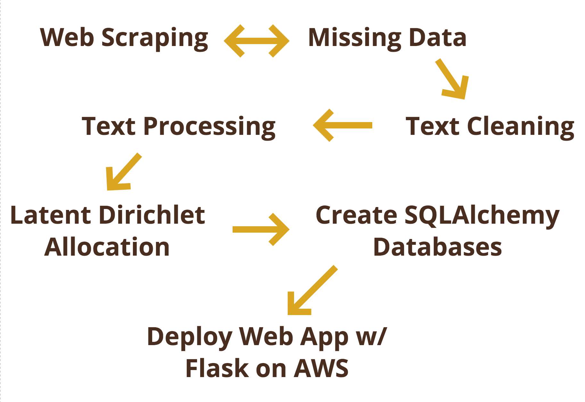
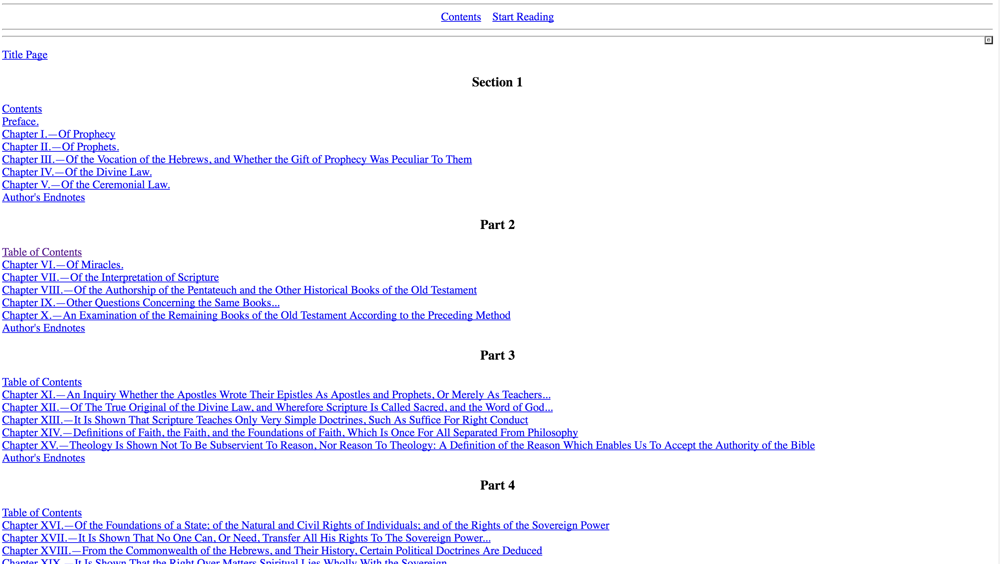
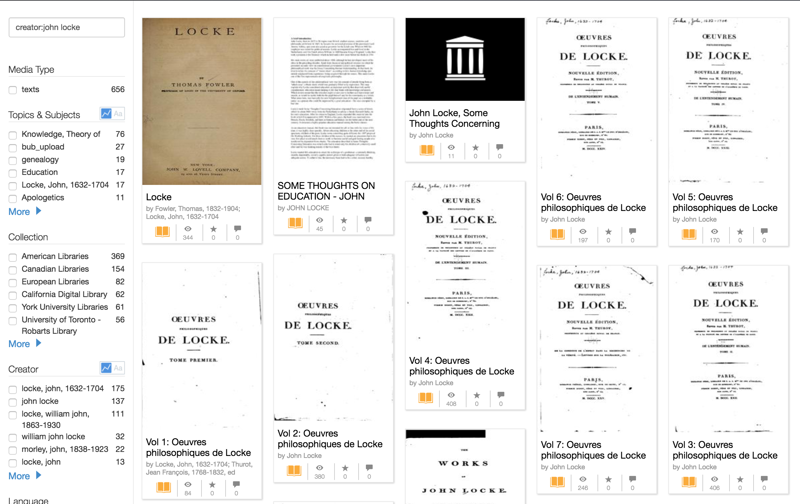
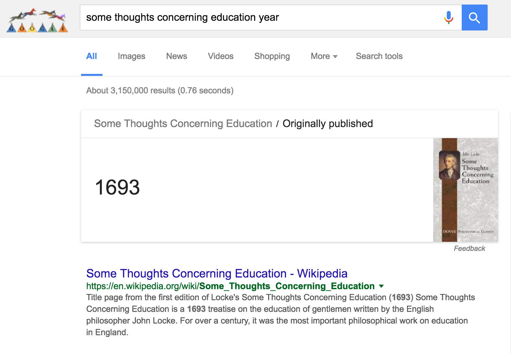

# A Journey Through Modern Era Philosophy

# Web Application
This app is live at [philosophyjourney.com](http://philosophyjourney.com)

# Motivation
Philosophy is a prime example of ideas changing the world.  Whether it be economics, political ideology, the freedom of man, or even the law of gravity, these are all ideas that fall under the realm of philosophy and have shaped the world as we know it today.

My goal with this project was to analyze the relationship between philosophy and the world.  How has philosophy influenced the world?  How has the world influenced philosophical discussion?  My project hopes to answer questions such as these.

# The Process

The first step of the process was web scraping various websites to obtain philosopher information as well as the full texts and other data for philosophical texts.

Then missing information was accounted for and entries with insufficient information dropped.

The full texts of the documents were then cleaned and prepared for analysis.  Latent Dirichlet Allocation was run on the prepped documents with varying topic sizes (150, 50, 25) and 30 passes.  The results of LDA were analyzed and utilized to glean insights into the data.  

These insights - along with the philosopher and document data - were then placed into an sqlite database using SQLAlchemy.

An app was created using Flask and front end web development technologies to visualize the results.  SQLAlchemy was used to communicate between the app and the database.

Although we used Python 2 throughout the program, I opted to use Python 3 for my project due to my project centering around Natural Language Processing.  Python 3's treatment of all text as unicode would remove the headache of dealing with both string and unicode data types.

# Web Scraping
*The web scraping process can be found in the [scrapers](scrapers) directory*

The first step in the process was data collection.  Both philosopher data and document data was needed to obtain insights through the analysis.  Eleven websites were scraped in total, resulting in the collection of data on over 200 philosophers and about 500 documents.  These numbers were later lowered during the data cleaning process.

I began by scraping for philosopher data, and then using the names I had collected scraped websites for documents by each respective philosopher.

The philosopher and document data were placed into [pandas](http://pandas.pydata.org/) dataframes for easily accessing and editing the data.  Classes were created for easily updating and saving the dataframe, which can be found in *[modern_dfs.py](modern_dfs.py)*.

### Challenges & Solutions
There were many challenges associated with the data collection process including, the largest being that it is difficult to find the full text of philosophical documents available for free online.  There was no go-to resource or database containing a large portion of the data I needed.  The web scraping was truly a process of searching and scraping the edges of the web for the data I needed.

Three sites had blocked me for short periods of time - <a href="https://www.gutenberg.org/wiki/Philosophy_(Bookshelf)">Project Gutenberg</a>, [Sacred Texts](http://sacred-texts.com/phi/), and the [Sophia Project](http://www.sophia-project.org/classical-philosophy.html).  However, I had already obtained the data I needed from Sacred Texts and the Sophia Project when they blocked me, and I discovered a python package specifically made for Project Gutenberg that allowed for me to obtain their documents.

Right off the bat, I was faced with a challenge I had never considered: scraping text from a PDF.  The documents on the first website I scraped ([Early Modern Texts](http://www.earlymoderntexts.com/texts)) were all in PDF format.

Luckily, the python community came through and there was a package called [PDFMiner3k](https://pypi.python.org/pypi/pdfminer3k) that provided a much simpler solution for this problem.

Above is two screenshots of document pages from [Sacred Texts](http://sacred-texts.com/phi/), one of the websites I scraped.  Both were taken from links on the home page, but one is in plain text format while the other has the text split into sections across multiple pages.  I initially performed my web scraping using only requests and beautiful soup, but this soon led to a problem when faced with Sacred Texts.

Thankfully, the Python package [Selenium](http://selenium-python.readthedocs.io/) and it's utilization of a web driver served as a way around this problem.

This problem of texts being in multiple formats would prove to be a persistent one, particularly during the text cleaning stage.

To the right is a screenshot of a document search on the [Internet Archive](https://www.archive.org).  The archive is considered one of the largest libraries of online texts available on the internet.  This solved some problems, but others arose from the volume of texts available.  The documents are pulled from a variety of resources, resulting in there being multiples of some works as well as texts in languages other than English - even when the "English" language filter was selected.  Furthermore, some documents were incomplete and searches for many philosophers returned no results.

Each document on the Internet Archive had a unique identifier, and their respective metadata and text files could be accessed and downloaded through this identifier (using the [internetarchive](https://internetarchive.readthedocs.io/en/latest/index.html) package).  I then used Selenium to run a search for each author, and logged the identifiers of texts that were complete and in English.  These were then logged into a JSON file and the necessary data was obtained through these identifiers.

Initially I had hoped to examine the entire history of philosophy - from pre-socratic era to contemporary.  However, there was simply not enough free resources available online.  As a result, by the end of my scraping process, I had sufficient data for the modern era of philosophy only.  The exact time period isn't definite, but is often accepted as roughly spanning from the 17th to 20th century.

Though my final scope was smaller than initially planned, it allowed for closer analysis of the documents and perhaps allowed me to glean better insights about the data overall.

### Obtaining Extra Data
In addition to the data obtained from the process above, I was interested in obtaining extra information for my analysis.  Utilizing Selenium, I was able to obtain the birthplace and nationality of each philosopher, which was eventually used in my web app to observe how the spread of philosophers changed throughout the years.  Though some philosophers moved far away from their birthplaces sometime in their life, a majority remained in or close to their hometowns, so I determined these special exceptions to not be very important.

# Data Munging
*The data cleaning process can be found in [clean_dfs.py](clean_dfs.py)*

Due to the fact that my data was obtained from various sites, there were many entries in both the philosopher and document data that had missing values.  

Where possible, missing data was filled in through utilizing Selenium to perform google seaches.  Many searches returned an element containing the value in interest; a majority of the missing values were filled in this way.

Nonetheless, this method wasn't perfect and there were multiple times there was no element like the one pictured to the right.  In cases like these, it was required to manually input the value.

### Text Cleaning & Processing

# Resources
### Web Scraping
#### Philosopher Data
* [Philosophy Basics](http://www.philosophybasics.com/historical.html)
* [Famous Philosophers](http://famous-philosophers.com/)
* [Wikipedia](https://en.wikipedia.org/)
* [English Club (Nationality Data)](https://www.englishclub.com/vocabulary/world-countries-nationality.htm)

#### Document Data
* [Early Modern Texts](http://www.earlymoderntexts.com/texts)
* [Sacred Texts](http://sacred-texts.com/phi/)
* [Sophia Project](http://www.sophia-project.org/classical-philosophy.html)
* <a href="https://www.gutenberg.org/wiki/Philosophy_(Bookshelf)">Project Gutenberg</a>
* [Value of Knowledge](https://www.marxists.org/reference/subject/philosophy/)
* [Internet Archive](https://www.archive.org)

#### Learning
* [Learning How to Build a Web Application](Learning How to Build a Web Application)
* [“Secret” Recipe for Topic Modeling Themes](http://www.matthewjockers.net/2013/04/12/secret-recipe-for-topic-modeling-themes/)
* [Preprocessing — Text Analysis with Topic Models for the Humanities and Social Sciences](https://de.dariah.eu/tatom/preprocessing.html)
* [Introduction to SQLAlchmey](https://www.youtube.com/watch?v=woKYyhLCcnU)
* [Dashing D3.js](https://www.dashingd3js.com/)

### Technical Stack
#### Cloud Computing
* [Amazon Web Services](https://aws.amazon.com/)

#### General
* [Python 3](https://docs.python.org/3.0/)
* [NumPy](http://www.numpy.org/)
* [pandas](http://pandas.pydata.org/)
* [matplotlib](http://matplotlib.org/index.html)
* [multiprocessing](https://docs.python.org/2/library/multiprocessing.html)
* [pickle](https://docs.python.org/3/library/pickle.html)
* [os](https://docs.python.org/3/library/os.html)
* [collections](https://docs.python.org/2/library/collections.html)

#### Web Scraping
* [Requests](http://docs.python-requests.org/en/master/)
* [Beautiful Soup](https://www.crummy.com/software/BeautifulSoup/bs4/doc/)
* [Selenium](http://selenium-python.readthedocs.io/)
* [PDFMiner3k](https://pypi.python.org/pypi/pdfminer3k)
* [langdetect](https://pypi.python.org/pypi/langdetect?)
* [us](https://pypi.python.org/pypi/us)
* [geopy](https://pypi.python.org/pypi/geopy/1.11.0)
* [internetarchive](https://internetarchive.readthedocs.io/en/latest/index.html)
* [gutenberg](https://pypi.python.org/pypi/Gutenberg)
* [bsddb3](https://pypi.python.org/pypi/bsddb3/6.1.1)

#### Text Processing
* [spaCy](https://spacy.io/)
* [NLTK](http://www.nltk.org/)
* [autocorrect](https://pypi.python.org/pypi/autocorrect/0.1.0)
* [PyEnchant](http://pythonhosted.org/pyenchant/)

#### Text Analysis
* [gensim](https://radimrehurek.com/gensim/)
* [SciKit-Learn](http://scikit-learn.org/stable/)

#### Web Application
* [Flask](http://flask.pocoo.org/)
* [SQLAlchemy](http://www.sqlalchemy.org/)
* [HTML5](https://developer.mozilla.org/en-US/docs/Web/Guide/HTML/HTML5)
* [CSS3](https://developer.mozilla.org/en-US/docs/Web/CSS/CSS3)
* [Javascript](https://www.javascript.com/)
* [jQuery](http://jquery.com/)
* [D3.js](https://d3js.org/)
* [Leaflet.js](http://leafletjs.com/)
