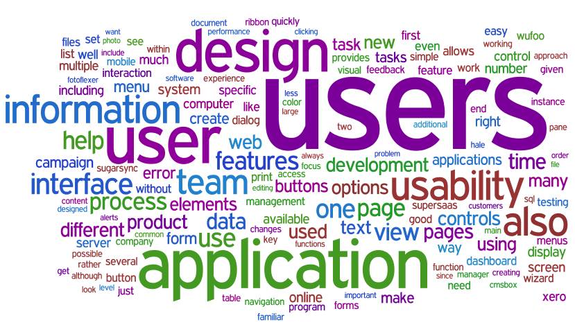

## A Journey through Philosophy's History
###### *Title to be changed*

### Story
* Follow the change in philosophical thinking through time
	* Analyze the different works being produced
	* See if there are any prominent topics being written about
* Show the differences between different regions
	* Difference between early greek and roman thought
	* Differences in thought between countries
* Focus on significant events that inspired changes of thinking (e.g. Renaissance)
* Explain importance of presentation
* Make inferences about future thought

### Application
* Slider that can be used to move throughout time
* Visuals to show the coming and going of topics as time continues
* Have a play button to play a continuous animation that moves from presocratic period to now.
	* Have music that is related to each time period (changes as slider moves)
	* Text-importance visualizations

		* 

* Have a search bar to enter in philosopher's name
	* Bring up basic information
		* Year born, birthplace, etc.
	* Bring up titles of all their works in database along with links to full-text
	* Have a summary of philosopher (e.g. from wikipedia)

### Data
* __Philosopher Data:__ Data on each philosopher

	* Image of philosopher
	* Nationality
	* Time period (Renaissance, Industrial Revolution, etc..)
	* Era
	* Birthplace
	* Year of Birth
	* Year of Death

* __Document Data:__ Data on each individual work

	* Name of work
	* Year of the work
	* Author of work
	* Text of the work
	* Link to the work

* __Document Word Data__

	* Word information for each document
	* NMF, SVD, TF-IDF

* __Philosopher Word Data__

	* Word information for each given philosopher
	* NMF, SVD, TF-IDF

### Insights
* What are the prevailing topics/words that appear during each time period?

* Can this thinking be related to the society and economy of that time period?

* What are the prevalent schools of thought?

* How are these thoughts still relevant today?

* Relationship to philosophy, war, economical crisis, societal problems, etc..

* How does philosophy today differ from before?

* What variables lead to more philosophical work being produced?

* What's similar between major times of thinking (e.g. renaissance, enlightenment, etc.)

* How has philosophy's role in society changed throughout time?

* How does philosophy shape the world during different time periods?

* Can the works be grouped into philosophical branches (metaphysics, ethics, etc.) through analyzing the text alone?
