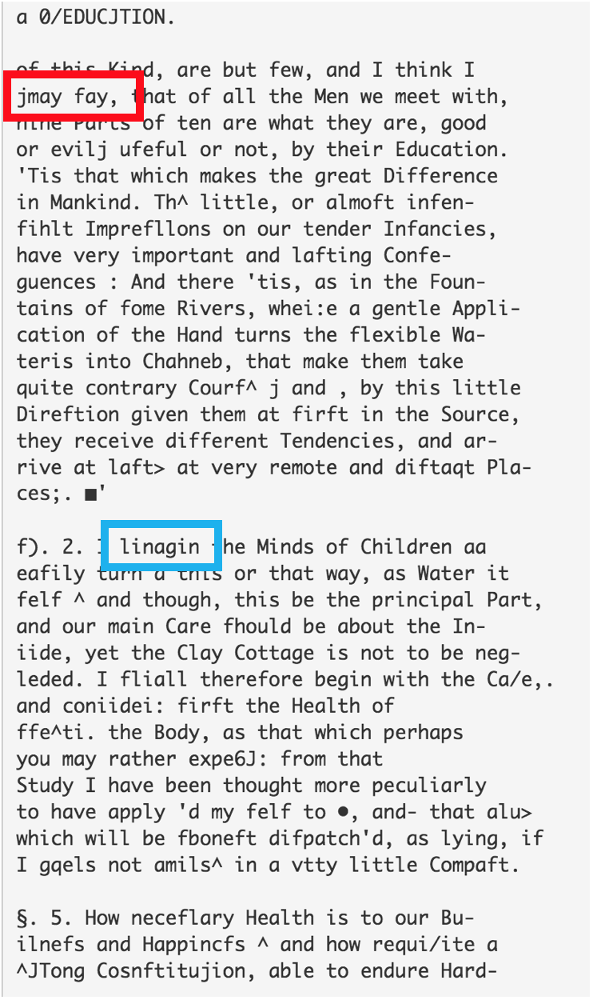

***NOTE: This README is still a work in progress***

# Defining Scope
When I first began this project, I had hoped to analyze philosophical thought from around 600 BC to 2016.  Many of my earlier scrapers and files were made with this plan in mind.  Throughout the data collection process, however, it became apparent that the resources needed for this scope just weren't available online.  Because of this, the scope was reduced to only the modern era of philosophy, and the files from that point on were written with this scope in mind.

# Web Scraping
The first step in the process was data collection.  Both philosopher data and document data was needed to obtain insights through the analysis.  Eleven websites were scraped in total, resulting in the collection of data on over 200 philosophers and about 500 documents.  These numbers were later lowered during the data cleaning process.

I began by scraping for philosopher data, and then using the names I had collected scraped websites for documents by each respective philosopher.

The philosopher and document data were placed into [pandas](http://pandas.pydata.org/) dataframes for easily accessing and editing the data.  Classes were created for easily updating and saving the dataframe, which can be found in *[modern_dfs.py](modern_dfs.py)*.

### Challenges & Solutions
There were many challenges associated with the data collection process including, the largest being that it is difficult to find the full text of philosophical documents available for free online.  There was no go-to resource or database containing a large portion of the data I needed.  The web scraping was truly a process of searching and scraping the edges of the web for the data I needed.

Three sites had blocked me for short periods of time - <a href="https://www.gutenberg.org/wiki/Philosophy_(Bookshelf)">Project Gutenberg</a>, [Sacred Texts](http://sacred-texts.com/phi/), and the [Sophia Project](http://www.sophia-project.org/classical-philosophy.html).  However, I had already obtained the data I needed from Sacred Texts and the Sophia Project when they blocked me, and I discovered a python package specifically made for Project Gutenberg that allowed for me to obtain their documents.

Right off the bat, I was faced with a challenge I had never considered: scraping text from a PDF.  The documents on the first website I scraped ([Early Modern Texts](http://www.earlymoderntexts.com/texts)) were all in PDF format.

Luckily, the python community came through and there was a package called [PDFMiner3k](https://pypi.python.org/pypi/pdfminer3k) that provided a much simpler solution for this problem.


Above is two screenshots of document pages from [Sacred Texts](http://sacred-texts.com/phi/), one of the websites I scraped.  Both were taken from links on the home page, but one is in plain text format while the other has the text split into sections across multiple pages.  I initially performed my web scraping using only requests and beautiful soup, but this soon led to a problem when faced with Sacred Texts.

Thankfully, the Python package [Selenium](http://selenium-python.readthedocs.io/) and it's utilization of a web driver served as a way around this problem.

This problem of texts being in multiple formats would prove to be a persistent one, particularly during the text cleaning stage.


To the left is a screenshot of a document search on the [Internet Archive](https://www.archive.org).  The archive is considered one of the largest libraries of online texts available on the internet.  This solved some problems, but others arose from the volume of texts available.  The documents are pulled from a variety of resources, resulting in there being multiples of some works as well as texts in languages other than English - even when the "English" language filter was selected.  Furthermore, some documents were incomplete and searches for many philosophers returned no results.

Each document on the Internet Archive had a unique identifier, and their respective metadata and text files could be accessed and downloaded through this identifier (using the [internetarchive](https://internetarchive.readthedocs.io/en/latest/index.html) package).  I then used Selenium to run a search for each author, and logged the identifiers of texts that were complete and in English.  These were then logged into a JSON file and the necessary data was obtained through these identifiers.

Initially I had hoped to examine the entire history of philosophy - from pre-socratic era to contemporary.  However, there was simply not enough free resources available online.  As a result, by the end of my scraping process, I had sufficient data for the modern era of philosophy only.  The exact time period isn't definite, but is often accepted as roughly spanning from the 17th to 20th century.

Though my final scope was smaller than initially planned, it allowed for closer analysis of the documents and perhaps allowed me to glean better insights about the data overall.

### Obtaining Extra Data
In addition to the data obtained from the process above, I was interested in obtaining extra information for my analysis.  Utilizing Selenium, I was able to obtain the birthplace and nationality of each philosopher, which was eventually used in my web app to observe how the spread of philosophers changed throughout the years.  Though some philosophers moved far away from their birthplaces sometime in their life, a majority remained in or close to their hometowns, so I determined these special exceptions to not be very important.

***The web scraping process can be found in the [scrapers](scrapers) directory***

# Data Munging

### Missing Data

Due to the fact that my data was obtained from various sites, there were many entries in both the philosopher and document data that had missing values.  


Where possible, missing data was filled in through utilizing Selenium to perform google seaches.  Many searches returned an element (left) containing the value in interest; a majority of the missing values were filled in this way.

Nonetheless, this method wasn't perfect and there were multiple times the search returned no element like the one pictured.  In cases like these, the code was paused and the value was entered manually by examining the existing search results.

Other missing values, such as time period, were calculated using values from other philosophers in the dataset.

### Insufficient Data

Even after the above process was completed, there were still some philosophers with no document data.  Any philosophers for which this was the case were dropped.  As for philosophers with only one document, them and their documents were removed from the datasets if their document was less than 30,000 words.

After all the entries with insufficient data were dropped, 143 philosophers and 453 documents remained.

### Challenges
There were some inherent challenges associated with this project, particularly due to the limited resources.


One of the biggest challenges was obtaining a truly representative dataset.  In the graph on the above left, the x-axis is the number of documents, and the y-axis is the number of philosophers with that number of documents.  It can be seen that a majority of philosophers have anywhere from 1-4 documents, and very few have more than 10.  Most of the philosophers have written many more texts than were in my dataset.  Despite this fact, the results were still quite good.

Another initial worry was the overwhelming difference in document lengths.  My dataset contained documents ranging from short essays to full books, and this can be seen through the distribution of document lengths (above left).  The graph is actually zoomed in to get a better idea of the distribution.  There were documents with over 100,000 words - with the largest being over 800,000 - while there were also many under 10,000 - the shortest being 669 words.  This challenge proved easy to solve however, as described in the text cleaning section.

***The data cleaning process can be found in [clean_dfs.py](clean_dfs.py)***

# Text Cleaning & Processing

### Misspellings
In the process of obtaining data from the [Internet Archive](https://www.archive.org), I had noticed that the plain text of some documents appeared to be scanned (below).  The books that were scanned appeared to be written in a font where some of the "s" characters looked like "f".  As can be seen from the images below, this could arise some serious problems if one tried to run any type of analysis on the document below.





**Left:** The original document, **Right:** The scanned text

In order to solve this problem, I utilized the Python package [PyEnchant](http://pythonhosted.org/pyenchant/), which has the functionality to check whether a word is actually an english word and, if not, suggest possible replacements.  
```python
# A short example showing PyEnchant's functionality
>>> import enchant
>>> d = enchant.Dict('en_US') # Loads the US English dictionary of words
>>> d.check("confideration") # Checks if argument is a real word
False
>>> d.suggest("confideration") # Suggests possible replacements for a string
['consideration', 'confederation', 'confide ration', 'configuration', 'confidential', 'confider', 'confirmation']
```
PyEnchant lists possible suggestions from highest to lowest probability.  Therefore, to fix misspellings in my text, I checked if each word was in the US English dictionary.  I chose to use the US English dictionary due to many translators being American.  If the word was not in the dictionary, I would replace it with the most likely replacement according to PyEnchant.  

Though in most cases it performed great, it's not perfect.  It doesn't perform so well on the the mispelled word "lnagin" (meant to be "imagine") from the image above (blue box)
```python
>>> d.check("lnagin")
False
>>> d.suggest("lnagin")
['linage', 'lineage', 'linkage', 'linguine']
```
As can be seen, the words suggested by PyEnchant aren't anywhere close to the word "imagine".  Despite this caveat, the results of my text analysis suggest PyEnchant did relatively well in fixing a majority of the misspellings, and these edge cases likely did not have a significant effect.  Furthermore, as there is no way to know what the word is supposed to be without manually looking at the context, these edge cases would prove to be very difficult to account for.

This process took quite long.  Even running on an Amazon AWS compute-optimized EC2 instance and utilizing 15 cores, the process still took 7-8 hours to complete.

### Preparing Texts
Once misspellings were fixed, I moved to preparing the texts for analysis.  A majority of my process was inspired these two articles, which provided me advice about possible problems that I had to consider prior to performing any analysis:
* [“Secret” Recipe for Topic Modeling Themes](http://www.matthewjockers.net/2013/04/12/secret-recipe-for-topic-modeling-themes/)
* [Preprocessing — Text Analysis with Topic Models for the Humanities and Social Sciences](https://de.dariah.eu/tatom/preprocessing.html)

#### Removing Stop Words


#### Breaking it up
At the advisement of the above articles, I chose to divide any large documents into chunks of about 1000 words.  The reasoning for this is that 1000 words is generally long enough to elaborate on a topic, while being short enough that many topics don't get mixed together.

After this, the original 453 documents had been broken up into 23,411 documents of 500-1500 words in length.

#### Part of Speech Tagging
Utilizing the Python package [spaCy](https://spacy.io/), I parsed each document and using POS tagging, extracting only the nouns from the text.  This process proved quite fast thanks to spaCy's multi-threading functionality, which is efficient and effective due to spaCy being written in Cython.

***The text cleaning process can be found in [text_processing.py](text_processing.py)***

# Latent Dirichlet Allocation
In order to analyze change in philosophical thought over time, it was first important to identify topics being discussed within the documents.  The two topic modeling algorithms I found myself choosing between were Non-negative Matrix Factorization (NMF) and Latent Dirichlet Allocation (LDA).  I decided on LDA, since it's use of a Dirichlet prior allows for increased variation of the topic and word distributions for the corpus.  Furthermore, [this paper by Stevens, Keith et. al.](http://aclweb.org/anthology/D/D12/D12-1087.pdf) shows LDA often outperforming NMF in both consistency and topic coherence.

I implemented LDA with three different numbers of topics - 150, 50, and 25.

### 150 Topics

### 50 Topics

### Final Model - 25 Topics

# Web Application

### Databases with SQLAlchemy

### Front End

### Back End

### Deployment

# Insights & Results
***For a summary of this interesting findings from this project, see [README.md](README.md)***
